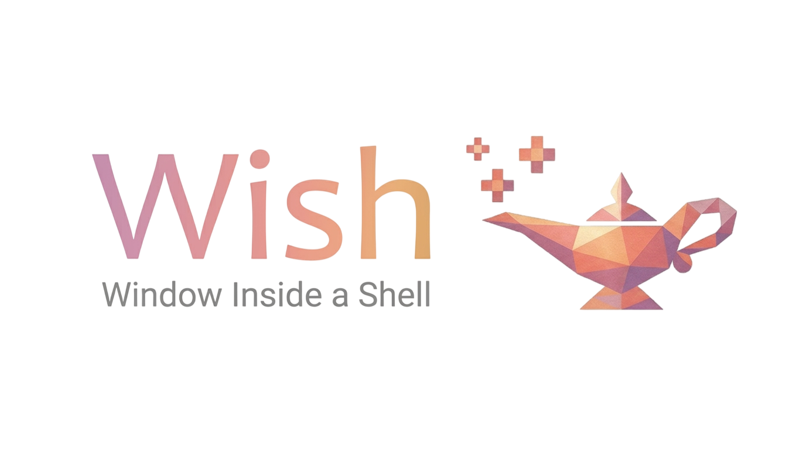

A remote UI framework built on [bison](https://github.com/binary-dice-games/bison). A wish server hosts a UI rendering loop and exposes a set of UI element classes over bison RMI. Client applications connect, define a UI hierarchy (in code or via JSON/YAML), and receive user-interaction events — all without owning a window or a graphics context.

## Architecture

```
Client App
  └─ wish client lib (bdg::wish::client)
       └─ bison RMI transport (TCP socket or pipes)
            └─ wish server (bdg::wish::server)
                 ├─ bison RMI server    <- object create / set / get / call / event
                 ├─ wish::renderer      <- abstract; imgui backend by default
                 └─ wish::file_service  <- per-session sandboxed resource store
```

- The **server** is transport-agnostic. The same UI class registry and renderer work with TCP socket, or any other bison transport.
- The **renderer** is an abstract interface (`wish::renderer`). The initial implementation uses imgui; other backends can be added without changing client code.
- **UI hierarchies** can be built object-by-object in code, or described in JSON/YAML and loaded via the template system.
- **UI templates** are registered on the server and instantiated by name — the standard way to define a UI hierarchy from a JSON or YAML string.
- The **file service** lets clients upload resources (images, fonts) to a sandboxed per-session folder. The folder is deleted when the client disconnects.
- **Multiple clients** can be connected simultaneously; each has an isolated session, object tree, and resource folder.

## Quick Build

```sh
cmake -S . -B build
cmake --build build
```

See [docs/building.md](docs/building.md) for prerequisites, CMake options, and platform notes.

## Quick Start

### Option A — register and instantiate a UI template

```cpp
// Register a named template (descriptor is parsed server-side on instantiate):
c.register_template("ConfirmDialog"_key, R"({
  "type": "Window", "title": "Confirm", "width": 300, "height": 120,
  "children": {
    "msg":    { "type": "Label",  "text": "" },
    "ok":     { "type": "Button", "label": "OK" },
    "cancel": { "type": "Button", "label": "Cancel" }
  }
})").get();

// Instantiate by name — can be called multiple times for independent copies:
auto dlg = c.instantiate_template("ConfirmDialog"_key).get();
dlg["msg"].set({{"text"_key, std::string{"Delete file?"}}}).get();
dlg["ok"].onEvent("clicked"_key, [](bison::dynamic) { /* ... */ });
```

### Option B — build the hierarchy manually

```cpp
auto win = c.instantiate("wish"_key, "Window"_key).get();
win.set({{"title"_key, std::string{"Hello"}}, {"width"_key, 400}}).get();

auto btn = c.instantiate("wish"_key, "Button"_key).get();
btn.set({{"label"_key, std::string{"OK"}}}).get();

// Named child reference (string key).
bison::dynamic children;
children["ok"_key] = btn.id();
win.set({{"children"_key, children}}).get();
```

### Uploading a resource

```cpp
// Upload logo.png; the server stores it in the session resource folder.
c.upload_file("logo.png", file_bytes).get();

// Reference it in an Image element.
auto img = c.instantiate("wish"_key, "Image"_key).get();
img.set({{"src"_key, std::string{"logo.png"}}, {"width"_key, 64}, {"height"_key, 64}}).get();
```

## Core Concepts

| Concept | Description |
|---------|-------------|
| **Object hierarchy** | UI elements are bison `dynamic` objects forming a tree. Children are addressed by numeric index (lists) or by name (named slots like `"ok"`, `"cancel"`). Layouts are first-class nodes in the tree. |
| **Layouts** | `VerticalLayout` stacks children top-to-bottom; `HorizontalLayout` places them side by side. Layouts can be nested to create row/column grids and complex arrangements. |
| **UI templates** | Named JSON/YAML blueprints stored on the server via `register_template`. `instantiate_template(name)` parses and creates a fresh object tree, returning a map of named handles. |
| **Remote properties** | `proxy.set(fields)` / `proxy.get()` synchronize typed fields. Property sets are one-way (no round-trip) for low-latency visual updates. |
| **Events** | Server-side interactions emit named events (`clicked`, `changed`, ...) to the client via `proxy.onEvent`. |
| **File service** | Clients upload/download files via `client::upload_file` / `download_file`. Files are stored in a sandboxed per-session folder, deleted on disconnect. |
| **Multi-client** | Each connected client has an isolated session: independent object tree, template registry, and resource folder. |
| **Renderer backends** | `wish::renderer` is an abstract interface. The SDL3 (windowed) and web (browser, via `--renderer web`) backends both build on it — see [docs/building.md](docs/building.md) for the `WISH_ENABLE_WEB` option and [src/web/DESIGN.md](src/web/DESIGN.md) for the browser renderer's architecture. New backends (Qt, terminal/TUI, ...) implement the same interface. |
| **Automation** | `WISH_ENABLE_AUTOMATION` extends the web renderer with a widget-tree/hit-test query API, letting a Playwright-driven headless browser (or an AI agent) introspect and drive a running wish UI — see [src/automation/DESIGN.md](src/automation/DESIGN.md), [docs/bindings.md](docs/bindings.md#automation-bindingspythonwishautomationpy), and `CLAUDE.md`'s "Automation" section. |
| **Transports** | TCP socket. Chosen at runtime; the renderer and class registry are independent of the transport. |

## Declaring bison RMI Classes (server-side)

Every server-side class follows this pattern:

1. **Inherit `bison::dynamic`** and declare a constructor that accepts a `bison::dynamic&&` base.
2. **Register the prototype** in a free `register_*()` function called from `registry.cpp`. Build the prototype, add all methods and fields with `DisplayName` attributes, then call `dynamic::addClass()`.
3. **Put methods on the prototype, not in the constructor.** Methods registered on the prototype are visible to `build_display_dict()` (which powers trace output) and are found by dispatch via prototype-chain lookup.
4. **Access instance state via `static_cast<T&>(self)`** — prototype method lambdas receive the actual instance as `dynamic& self`, not `this`.
5. **Describe parameter fields with input/output specs** on the method constructor. This is how `build_display_dict()` resolves param key hashes to human-readable names in logs.

```cpp
// register_*(): prototype declares the full schema
void register_my_service() {
  auto proto = dynamic_ptr{"__MyService"_key, {}};

  auto call_in = std::make_shared<dynamic>();
  call_in->addField("value"_key, field{0, attr<DisplayName>("value")});

  proto->addMethod("doThing"_key, bison::method{
    [](dynamic& s, const dynamic& p) -> dynamic {
      static_cast<my_service&>(s).do_thing(p.as<int>("value"_key));
      return dynamic{};
    },
    dynamic_ptr{call_in}, nullptr,
    attr<DisplayName>("doThing")});

  dynamic::addClass("wish"_key, std::move(proto));
}

// Constructor: only initialization, no addMethod calls
my_service::my_service(bison::dynamic&& base) : dynamic(std::move(base)) {}
```

For classes that need a factory (server instantiates via RMI `INSTANTIATE`), see `register_ui_template()` in `src/ui/ui_template.cpp` for the `make_factory<T>` pattern.

## Security Considerations for AI Code Assist

When generating or modifying wish server-side code, AI agents must follow these rules:

### File access is sandboxed per session

Every client session has an isolated temporary directory (`session::resource_dir`).
Widget fields that accept file paths (e.g. `Image::src`, `TextEditor::file_path`)
**must** be validated against this sandbox before any file I/O:

- **Relative paths** are resolved with `resolve_widget_path()` (defined in
  `src/imgui/imgui_ui_renderer.hpp`), which uses purely lexical normalization to
  verify the resolved path stays inside `resource_dir`. Never skip this check.
- **Absolute paths** are rejected by default. They are permitted only when the
  server has been explicitly configured with
  `wish::server::set_allow_absolute_paths(true)` — which is intended exclusively
  for same-process (`memory_transport`) deployments.
- **Never** construct file paths from untrusted client input without going through
  `resolve_widget_path()` or `file_service::resolve_path()`.  A path like
  `../../etc/passwd` must be rejected, not silently truncated or accessed.

### Adding new file-accessing widgets

Any new widget whose render function reads or writes a file must:

1. Accept only a **relative** path field by default.
2. Call `resolve_widget_path(path, s.resource_dir, s.allow_absolute_paths)` and
   return early if the result is empty.
3. Document the field's security contract in the registration attributes
   (see `src/ui/ui_elements/text_editor.cpp` as a reference).

### Optional auth module and persistent sandbox directories

By default every session's `resource_dir` is a throwaway temp directory,
deleted on disconnect. A server can opt in to a persistent, identity-keyed
directory per client via `wish::server::start(auth_module)` (an optional
`bison::rmi::auth_module_ptr`, evaluated once per connection) together with
`wish::server::set_allow_absolute_paths`'s sibling setter,
`set_persistent_sandbox_root(path)` — both are required before any session
gets a directory outside the default temp location. `wish::local_auth_module`
is a ready-to-use, trust-the-client module for local/single-user deployments;
untrusted or remote deployments must supply their own `auth_module_iface`
that verifies the client's claimed identity. See `src/auth/DESIGN.md` for
the full design and the sandbox-escape guard applied to the identity string.

### Uploads and downloads

`file_service::upload` / `download` already enforce sandboxing via
`file_service::resolve_path()`.  Do not bypass or replicate this logic; call the
method directly.

### Session isolation

Each `wish::session` is independent: object tree, resource folder, file service,
and style service are all isolated.  Do not share mutable session state across
sessions or cache per-session resources in process-global structures keyed by
anything other than the session ID.

## Further Documentation

| File | Contents |
|------|----------|
| [docs/building.md](docs/building.md) | Prerequisites, CMake options, build commands, running the server |
| [docs/examples.md](docs/examples.md) | Annotated example walkthroughs |
| [docs/bindings.md](docs/bindings.md) | Python language binding setup and usage |
