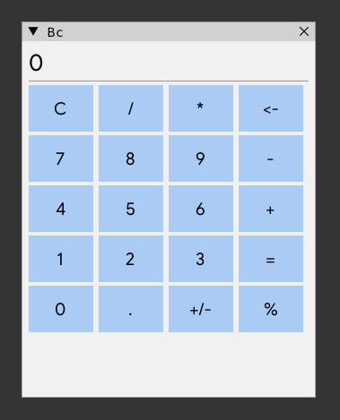

# bc

Four-function calculator; demonstrates self-contained server-side form
logic — all arithmetic runs server-side, the client only instantiates the
form and listens for the `"closed"` event.

- **server/**: `Bc` form (`register_bc()`), a
  `bdg::wish::form` subclass owning the window/button-grid/display and all
  arithmetic.
- **client/**: `run_bc(wish_app_host&)`, self-registered as the
  `"bc"` embedded app — instantiates the form, keeps it alive until
  the window closes.
- **resources/**: none.
