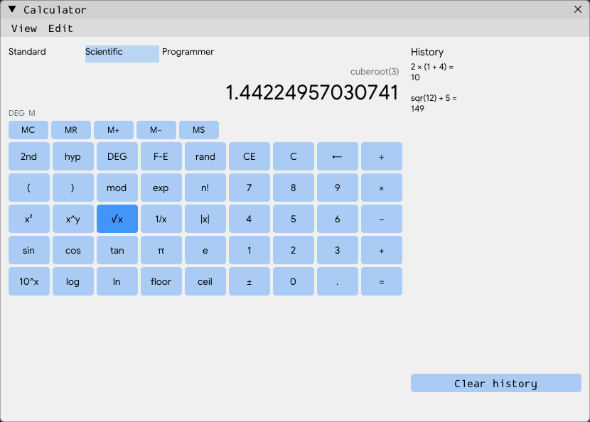

# bc

Calculator with three switchable layouts, modeled on the Windows, GNOME and
macOS calculators. Switch with the mode tabs under the menu bar or
**View > Standard / Scientific / Programmer**; the window resizes to the
active keypad. All arithmetic runs server-side.

| Mode | Keys |
|------|------|
| **Standard** | `+ − × ÷ =`, `%`, `1/x`, `x²`, `√x`, `±`, `CE`, `C`, `←` (backspace). Evaluates left to right as you type (2 + 3 × 4 = 20). |
| **Scientific** | Operator precedence and parentheses (2 + 3 × 4 = 14; `2(3)` implies ×). `sin cos tan` in DEG/RAD/GRAD, with `2nd` (inverse) and `hyp` (hyperbolic); `x²`/`x³`, `x^y`/`y√x`, `√x`/`³√x`, `10^x`/`2^x`, `log`/`log_y x`, `ln`/`e^x`, `1/x`, `|x|`, `n!`, `mod`, `floor`, `ceil`, `π`, `e`, `rand`, `exp` (enter 1.5e+3) and `F-E` (force scientific notation). |
| **Programmer** | Signed two's complement integers of `QWORD`/`DWORD`/`WORD`/`BYTE` size, shown at once in HEX/DEC/OCT/BIN (click a row to type in that radix; digits that don't fit are rejected). `A`–`F`, `AND OR XOR NAND NOR NOT`, `<<`, `>>` (arithmetic), `RoL`/`RoR` (one-bit rotates), `mod`, parentheses. |

Every mode has memory keys (`MC MR M+ M− MS`, an `M` in the status line
when memory is set), a history panel (**View > History**: the last 10
calculations; click one to recall its result), **View > Digit grouping**,
and **Edit > Copy** (copies the display). Pressing `=` again repeats the
last operation (5 + 3 = = gives 11). Errors (division by zero, domain
errors, overflow) show a message until the next digit or `C`.

- **server/**: `Bc` form (`register_bc()`), a `common::tool_form` subclass
  that generates the window and keypads and routes keys, and
  `calc::engine` (`calc_engine.hpp`), the UI-independent calculator state
  machine (entry editing, shunting-yard precedence, memory, history, modes),
  unit-tested directly in `tests/test_bc.cpp`.
- **client/**: `run_bc(wish_app_host&)`, self-registered as the `"bc"`
  embedded app — instantiates the form, keeps it alive until the window
  closes.
- **resources/**: none.
