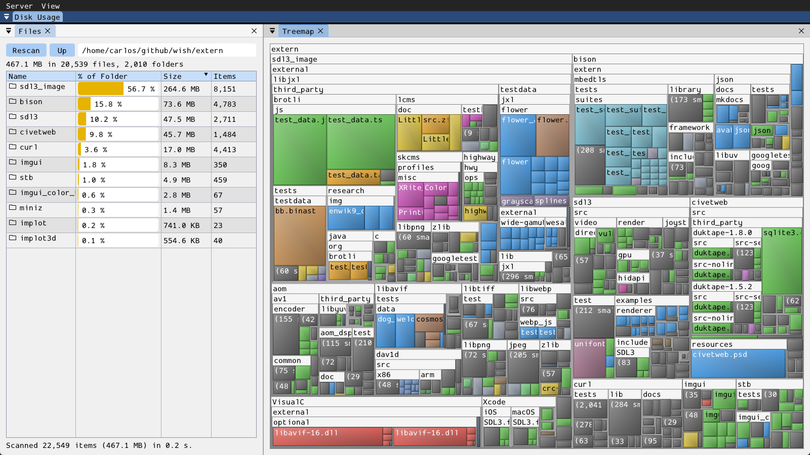

# du



A disk usage analyzer in the spirit of WizTree/WinDirStat: scan a folder
and see what takes the space. Two dockable panels side by side inside its
own nested "Disk Usage" dockspace (see
[docs/dock-layout.md](../../../../docs/dock-layout.md)) — Files as a
fixed-width panel on the left, the Treemap filling the rest of the screen:

- **Files** — the path bar (type a folder and press Enter to scan it),
  **Rescan** (reads **Stop** while a scan is running) and **Up**, a summary
  of the folder on display, and a sortable table of its contents: name,
  share of the folder as a bar, size, and number of items inside. Largest
  first by default. Double-click a folder to open it, `..` to go back.
- **Treemap** — the folder's whole subtree as nested rectangles, each sized
  by its bytes. Folders are frames titled with their name; files are tiles
  colored by type (images, video, audio, archives, binaries, source code,
  documents, data — other extensions get a color of their own). Hover for
  an item's path and size, click to select it (its top-level entry is
  highlighted in the table, its full path shown in the status line),
  double-click to open the top-level folder it belongs to.

Selecting a table row outlines the matching rectangle. Detail too small to
see is merged: in the treemap, the items of a folder that are each under
1/2500 of the displayed folder become one grey "(N smaller items)" tile; in
the table, a listing longer than 1000 entries ends with one such row.

```sh
wish client --run=du                # the current directory
wish client --run=du -- /var/log    # a given folder
```

What is measured: apparent file sizes (not allocated blocks). Symbolic
links are not followed. On Linux the scan stays on the starting folder's
filesystem, like `du -x`, so mount points below it (`/proc`, other disks,
network shares) show as empty folders. A file with several hard links is
counted once per link. Folders that cannot be read are skipped and counted
in the final status message.

- **server/**: `Du` form (`register_du()`), a `bdg::wish::form` subclass
  owning both panels, the table's sorting and selection, and the mapping
  between table rows and treemap nodes. It has no filesystem access — the
  folder lives on the client's machine — so it emits `on_scan_requested`,
  `on_cancel_requested` and `on_navigate` for the client to act on (answered
  with `show_directory()`), and `closed` when a panel is dismissed. It only
  ever holds the one folder on display.
- **client/**: `run_du(wish_app_host&)`, self-registered as the `"du"`
  embedded app. `du_scan.hpp/.cpp` does the scan and flattens a folder's
  subtree into the `Treemap` element's arrays (plain C++, no bison
  dependency); `du.cpp` keeps the scanned tree in memory and sends the form
  one folder at a time. Scans run on a `common::command_worker` thread
  (`modules/bdg/common/command_worker.hpp`), reporting progress to the
  form's status line.
- **resources/**: none.

The treemap itself is the core `Treemap` element (see
[docs/ui-elements.md](../../../../docs/ui-elements.md#treemap)), usable by
any wish UI.
