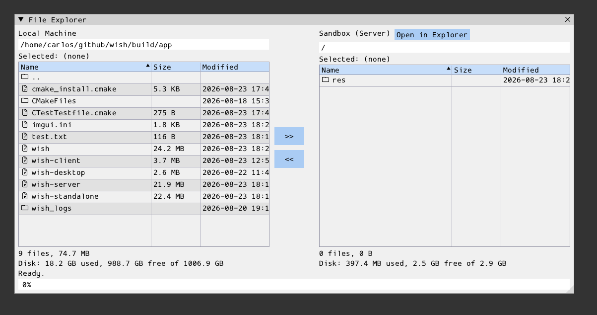

# mc

Two-panel file browser: the local machine (left, client-driven) next to the
session sandbox (right, server-driven), with upload/download transfer
buttons and an "Open in Explorer" shortcut for the sandbox side. Each panel
shows a small disk-usage summary strip (file count/total size of the
listed directory, plus used/free/total space for its filesystem) below its
table, and each row offers a right-click context menu (Properties, Rename,
Copy Path).

Both panels support multi-row selection: Ctrl+click toggles one row without
touching the rest, and Shift+click (or holding Shift while dragging across
rows) selects the contiguous range from the last plain-clicked row. The
upload/download buttons act on every selected file at once (selected
directories are silently skipped).

- **server/**: `Mc` form (`register_mc()`), a
  `bdg::wish::form` subclass owning the window/panels/tables and all
  sandbox navigation/listing (`std::filesystem` + `file_service::resolve_path()`
  against `context::resource_dir`), including the sandbox panel's own
  disk-usage strip, its rows' Rename/Properties (both handled directly,
  server-side), and each panel's multi-selection state (name-keyed, so it
  survives a re-sort). Emits `on_local_navigate`, `on_upload_requested`/
  `on_download_requested` (`{names, ...}`, one event per click covering
  every selected file — or, when some/all of those targets already exist,
  `on_upload_conflict`/`on_download_conflict`), `on_local_rename_requested`
  (the local panel's Rename dialog was confirmed), and `closed` for the
  client to react to. Copy Path never touches the server round trip at all
  — it rides `MenuItem.copy_text` (`src/ui/ui_elements/menu.cpp`), copied to
  the OS clipboard directly by the renderer.
- **client/**: `run_mc(wish_app_host&)`, self-registered as the
  `"mc"` embedded app — instantiates the form, enumerates the
  local filesystem (and its disk usage) in response to `on_local_navigate`,
  renames a local file/directory in response to
  `on_local_rename_requested`, and moves bytes between the local machine and
  the sandbox in response to `on_upload_requested`/`on_download_requested`,
  transferring a multi-file batch sequentially on one background thread so
  the shared progress bar shows one coherent transfer at a time. A conflict
  event instead instantiates the built-in `MessageBox` form ("yes_no"
  preset) to confirm once with the user before overwriting the whole batch.
- **resources/**: none.
