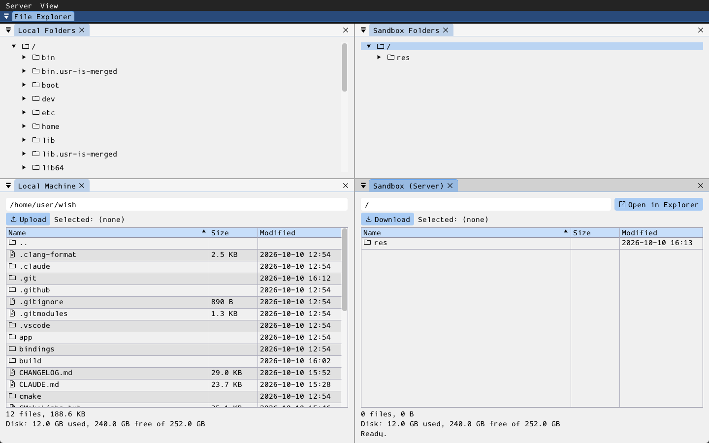

# mc

Two-panel file browser laid out as dockable panels inside its own
nested "File Explorer" dockspace (see [docs/dock-layout.md](../../../../docs/dock-layout.md)):
**Local Machine** (client-driven) and **Sandbox (Server)** (server-driven,
with an "Open in Explorer" shortcut), each with a folder tree to its left
(**Local Folders**, **Sandbox Folders**). Each file panel has the button
that sends its selected files to the other one (**Upload >>** in Local,
**<< Download** in Sandbox). The first run seeds them side by side;
rearrange freely afterwards (Shift+drag to re-dock). Closing any panel
closes the tool.

The folder trees list directories only, Explorer-style: click a folder to
show it in the file panel, click its arrow to expand it. Navigating the file
panel (typing a path, opening a folder, "..") expands the tree down to the
new directory and selects it. A tree is filled one level at a time -- only
the top level (the filesystem roots, or the sandbox root and its
directories) is sent at startup, and a node's children are fetched the first
time it is expanded.

Transfers run in the background, one file at a time. One that takes more
than a moment opens the same modal progress dialog the dev tools (docker,
kubectl, ...) use, here with a bar showing the bytes moved and a **Cancel**
button (a cancelled upload leaves the sandbox as it was); failures stay in
the dialog until **Close** is pressed. Each panel
shows a small disk-usage summary strip (file count/total size of the
listed directory, plus used/free/total space for its filesystem) below its
table, and each row offers a right-click context menu (Properties, Rename,
Copy Path).

Both panels support multi-row selection: Ctrl+click toggles one row without
touching the rest, and Shift+click (or holding Shift while dragging across
rows) selects the contiguous range from the last plain-clicked row. The
upload/download buttons act on every selected file at once (selected
directories are silently skipped).

- **server/**: `Mc` form (`register_mc()`), a
  `bdg::wish::form` subclass owning the two panels/tables and all
  sandbox navigation/listing (`std::filesystem` + `file_service::resolve_path()`
  against `context::resource_dir`), including the sandbox panel's own
  disk-usage strip, its rows' Rename/Properties (both handled directly,
  server-side), and each panel's multi-selection state (name-keyed, so it
  survives a re-sort), and both folder trees (the sandbox one enumerated
  directly, the local one filled by the client through
  `update_local_tree()`). Emits `on_local_navigate`, `on_local_tree_expand`
  (a local tree node needs its subdirectories), `on_upload_requested`/
  `on_download_requested` (`{names, ...}`, one event per click covering
  every selected file — or, when some/all of those targets already exist,
  `on_upload_conflict`/`on_download_conflict`), `on_local_rename_requested`
  (the local panel's Rename dialog was confirmed), and `closed` for the
  client to react to. Copy Path never touches the server round trip at all
  — it rides `MenuItem.copy_text` (`src/ui/ui_elements/menu.cpp`), copied to
  the OS clipboard directly by the renderer.
- **client/**: `run_mc(wish_app_host&)`, self-registered as the
  `"mc"` embedded app — instantiates the form, enumerates the
  local filesystem (and its disk usage) in response to `on_local_navigate`,
  sends one level of the local folder tree per `on_local_tree_expand`,
  renames a local file/directory in response to
  `on_local_rename_requested`, and moves bytes between the local machine and
  the sandbox in response to `on_upload_requested`/`on_download_requested`,
  all as jobs on one `common::command_worker`
  ([modules/bdg/common/command_worker.hpp](../../common/command_worker.hpp)),
  which shows the progress dialog for long ones (a multi-file batch is one
  job, transferred sequentially). A conflict
  event instead instantiates the built-in `MessageBox` form ("yes_no"
  preset) to confirm once with the user before overwriting the whole batch.
- **resources/**: none.
