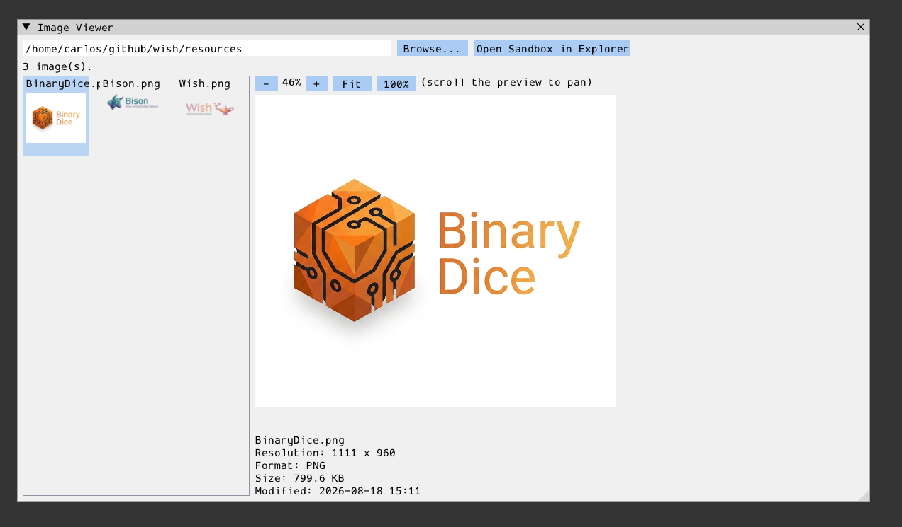

# pix

Local image folder viewer: a thumbnail grid on the left, a zoomable/
pannable full preview + metadata panel on the right. Demonstrates a form
that's almost entirely client-driven — the server only owns UI structure
and the sandbox-local "Open in Explorer" action; all local directory
enumeration, image decoding, thumbnail/preview generation (via
`stb_image`/`stb_image_resize2`/`stb_image_write`), and sandbox uploads
happen client-side.

- **server/**: `PixViewer` form (`register_pix()`), a `bdg::wish::form`
  subclass owning the window/toolbar/thumbnail-grid/preview/info-panel and
  routing button/selection events. The thumbnail grid and the preview
  viewport are both a `Table` (see `pix.hpp`'s class comment) so each
  scrolls independently — the preview Table's own native scrollbars are
  the "pan" control once zoom grows the image past the fixed viewport.
  Exposes `set_images`/`set_thumbnail`/`set_preview`/`set_info`/
  `set_status`/`stat_files` for the client to push data, and emits
  `on_browse_clicked`/`on_path_submitted`/`on_image_selected`/
  `on_view_control` for user intent.
- **client/**: `run_pix(wish_app_host&)`, self-registered as the `"pix"`
  embedded app. Enumerates the local directory (PNG/JPEG/BMP/TGA/GIF),
  compares each file's local mtime against its already-uploaded sandbox
  copy's mtime (via `stat_files`) before regenerating a thumbnail or
  re-uploading the full image, and does all of that asynchronously on
  background threads so browsing a large folder or a big image never
  blocks the UI. Folder selection reuses the built-in `FileDialog` form
  (navigate to a directory, then confirm).
- **resources/**: none (the generic placeholder thumbnail is the top-level
  `res/icons/image.png` every session already gets).
