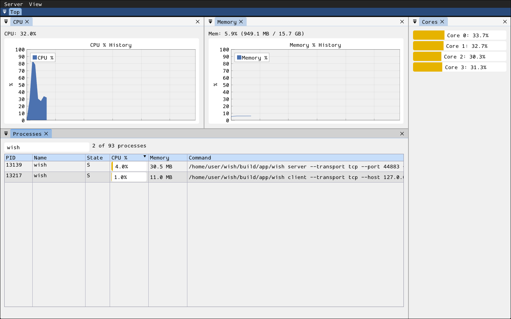

# top

top/htop-style system monitor laid out as four dockable panels inside its
own nested "Top" dockspace (see [docs/dock-layout.md](../../../../docs/dock-layout.md)):
**Processes** (sortable table with a name filter, right-click a row for kill/pause/priority/
affinity/properties), **CPU** and **Memory** (history graphs), and **Cores**
(one meter per logical core). The first run seeds the graphs above the
process table with the core meters along the right; rearrange freely
afterwards (Shift+drag to re-dock). Closing any panel closes the tool.
All sampling is client-side
(inherently OS-specific, and the machine a user wants visibility into is
their own) — the server-side form only renders whatever snapshot it was
last given.

- **server/**: `Top` form (`register_top()`) —
  read-only rendering of whatever snapshot its `update_snapshot` RMI method
  was last called with.
- **client/**: `run_top(wish_app_host&)`, self-registered as
  the `"top"` embedded app — owns process/CPU/memory sampling
  (platform-specific: `process_info_linux.cpp`/`process_info_win.cpp`) and
  periodically pushes a fresh snapshot to the form.
- **resources/**: none.
