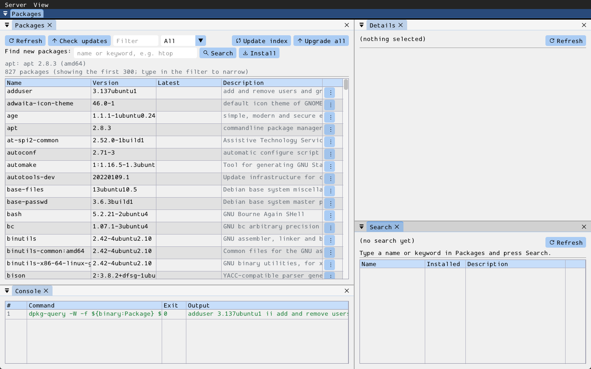

# pkg

One GUI over the system package managers — **apt**, **dnf**, **pacman** and
**brew** — with the same windows and actions whichever one is in use: the
installed packages with per-row actions, a search of the package index to find
and install new ones, a text pane for a package's description or file list,
and a trace of every command run. This is a pure frontend: every operation
runs the real package manager already on the machine. Modelled on the sibling
[pip](../pip/README.md) module (same client/server split, list-window
plumbing, `MessageBox` confirm and shared progress dialog).

`wish client --run=pkg [-- <manager> [<elevation>]]`

- `<manager>`: `apt`, `dnf`, `pacman` or `brew`. Without it, the first one
  found on the machine (in that order) is used.
- `<elevation>`: how commands that change the system get root — `sudo`,
  `pkexec`, `none`, or `auto` (the default: nothing when already root,
  otherwise `pkexec` if it is installed, otherwise `sudo`). brew never needs
  it.

If the chosen manager's command line is not installed, the tool does not open
a window: it prints what is missing, and which supported managers *are*
available, to the console and exits. An unknown manager or elevation name is
reported the same way.

Listing, searching and inspecting run as the current user. Installing,
removing, upgrading and refreshing the index run through the elevation
command (`sudo -n apt-get install -y ...`). The tool has no terminal to type a
password into, so `sudo` only works with cached credentials (run `sudo -v` in
the terminal first) or a `NOPASSWD` rule; `pkexec` asks in its own dialog. A
refused request is explained in the progress dialog.

Refresh is **manual**: a Refresh button plus an automatic refresh after every
mutating action. **Remove**, **Reinstall** and **Upgrade all** are gated
behind a `MessageBox` confirm; installs and single upgrades fire directly.
Commands run on a background worker thread behind the collection's shared
modal progress dialog (see the [bdg/dev README](../README.md)).

- **server/**: `PkgFrontend` form (`register_pkg()`) — knows nothing about any
  particular package manager. Renders whatever snapshot it was last given via
  `update_packages` / `update_search` / `update_details` / `set_environment` /
  `append_command_log`, and emits `*_requested` events (see `server/pkg.hpp`'s
  class doc comment for the full contract).
- **client/**: `run_pkg(wish_app_host&)`, self-registered as the `"pkg"`
  embedded app. `client/pkg_backend.hpp`/`.cpp` holds everything that differs
  between managers: one function per operation returning the argv to run, one
  parser per listing, the elevation wrapper and name validation — pure
  functions of a `manager` value, so adding a manager means adding an
  enumerator and a case to each. `client/pkg_source.hpp`/`.cpp` runs the
  commands and pushes snapshots through the shared [common/](../../common)
  helpers (`process.hpp`, `tool_source.hpp`).
- **resources/**: none.

Build: off by default. `cmake -S . -B build -DWISH_MODULE_BDG_DEV_PKG=ON`
(or `-DWISH_COLLECTION_BDG_DEV=ON` for the whole `bdg/dev` collection).

## Windows

- **Packages** — the installed packages: Name / Version / Latest /
  Description, with a name filter and an All / Upgradable selector. The first
  status line names the manager, its version and the elevation in use.
  - **Check updates** fills the Latest column from the index as last
    refreshed; **Update index** refreshes the index from the repositories
    first (needs root, except with brew); **Upgrade all** upgrades everything
    upgradable.
  - *Find new packages*: type a name or keyword and press **Search** to list
    matches in the Search window, or type exact package names and press
    **Install**.
  - Row menu: Details, Files, Upgrade, Reinstall, Remove.
- **Search** — the index search results: Name / Installed (the installed
  version, if any) / Description. Row menu: Details, Install.
- **Details** — the package's description or the files it installed.
- **Console** — a scrolling, FIFO-capped table tracing every command the
  module ran, green on success, red on failure; right-click a row for "Copy
  Entry" or "Clear Console".

## What each operation runs

| Operation | apt | dnf | pacman | brew |
|-----------|-----|-----|--------|------|
| List installed | `dpkg-query -W` | `rpm -qa` | `pacman -Q` | `brew list --versions` |
| Check for updates | `apt list --upgradable` | `dnf check-update` | `pacman -Qu` | `brew outdated --verbose` |
| Update index | `apt-get update` | `dnf makecache --refresh` | `pacman -Sy` | `brew update` |
| Search | `apt-cache search` | `dnf search` | `pacman -Ss` | `brew search` |
| Details | `apt-cache show` | `dnf info` | `pacman -Qi` / `-Si` | `brew info` |
| Files | `dpkg -L` | `rpm -ql` | `pacman -Ql` | `brew list --verbose` |
| Install | `apt-get install -y` | `dnf install -y` | `pacman -S --needed` | `brew install` |
| Upgrade one | `apt-get install --only-upgrade` | `dnf upgrade -y` | `pacman -S` | `brew upgrade` |
| Reinstall | `apt-get install --reinstall` | `dnf reinstall -y` | `pacman -S` | `brew reinstall` |
| Remove | `apt-get remove -y` | `dnf remove -y` | `pacman -R` | `brew uninstall` |
| Upgrade all | `apt-get upgrade -y` | `dnf upgrade -y` | `pacman -Su` | `brew upgrade` |

## Known limitations

- **Only apt has been run for real.** dnf, pacman and brew are implemented
  from their documented output and checked by unit tests against sample
  output (`tests/test_pkg_backend.cpp`), plus one end-to-end run against a
  script emulating `brew`; they have not been exercised on a machine that has
  them. Mutating apt commands were not run either (no root available where
  this was developed) — only their refusal path.
- **At most 300 rows are shown per table.** A system has thousands of
  packages; the status line says how many match, and the filter reaches the
  rest.
- **Column content varies by manager**: `pacman -Q` and `brew list` give no
  description; only pacman's search reports a version.
- **No autoremove / purge, no repository management, no holds or pins**, and
  no choice of version to install.
- **pacman single upgrades are partial upgrades** (`pacman -S <name>`), which
  Arch discourages; prefer Upgrade all.
- **`sudo` cannot prompt.** See the elevation notes above.
- **Progress is indeterminate**, and Cancel stops the manager the way Ctrl-C
  would: a half-finished transaction is not rolled back.
